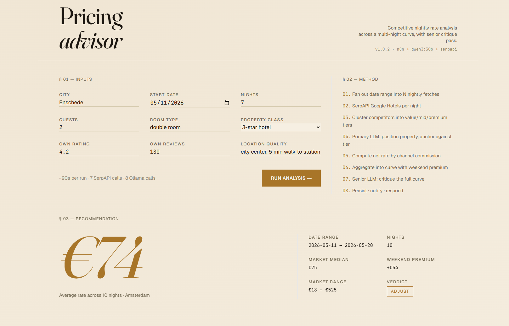
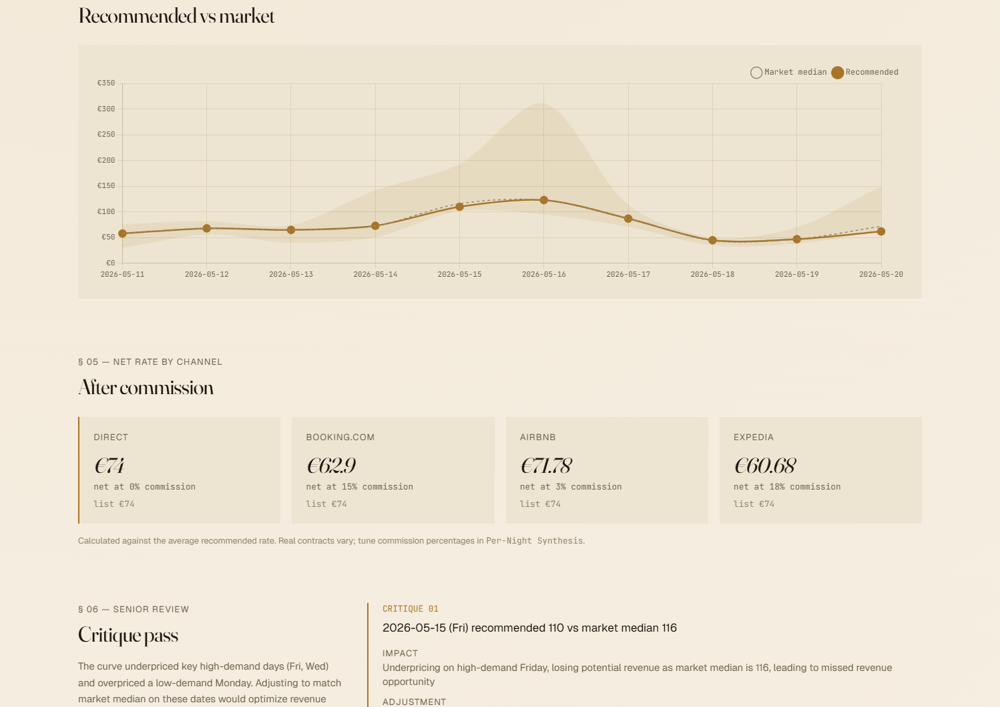
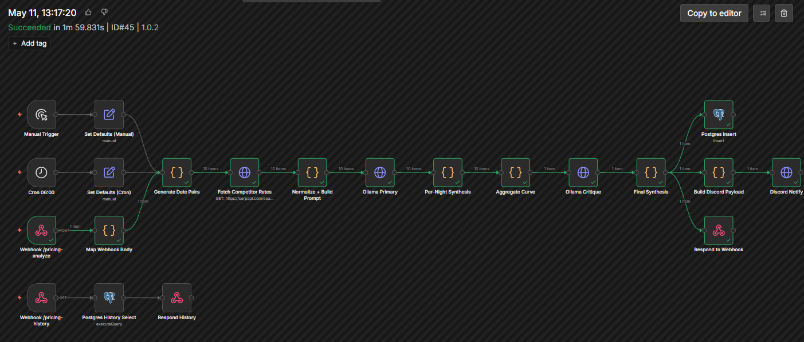

# pricing-advisor-web

A single-page editorial dashboard for a competitive nightly pricing workflow. The frontend is one HTML file with Tailwind via CDN, Chart.js for the curve, and vanilla JS for everything else. The actual analysis pipeline lives in a self-hosted n8n workflow that scrapes competitor rates, clusters them, asks a local Ollama model for a recommendation, runs a senior critique pass on the full curve, computes net rate by channel commission, and persists every run to Postgres.

Shipped as a multi-arch container (`linux/amd64`, `linux/arm64`) via GitHub Actions to GHCR. Multi-stage release pipeline so a `vX.Y.Z` tag becomes a pinnable image in a couple of minutes.

[](LICENSE)
[](https://github.com/hexiejexie/pricing-advisor-web/actions/workflows/docker-publish.yml)
[](https://github.com/hexiejexie/pricing-advisor-web/releases)
[](https://github.com/hexiejexie/pricing-advisor-web/pkgs/container/pricing-advisor-web)

Live at [pricing.hexie.dev](https://pricing.hexie.dev).



## What it does

You give it a city, a start date, a number of nights, and your own property's class, rating, and review count. It returns:

- A recommended rate per night across the date range, with weekend premium quantified
- Three closest comparable competitors per night, anchored on rating and review count rather than raw price
- A senior critique pass that finds the three strongest weaknesses in the curve and proposes specific adjustments in EUR
- Net rate per channel after typical OTA commissions (Direct, Booking.com, Airbnb, Expedia)
- Persistent history of every run with click-to-restore

The dashboard is read-only on top of the workflow. All state lives in Postgres on the n8n side.



## Architecture

```
              browser
                 |
                 v
        +------------------+
        | pricing.hexie.dev|  (CloudPanel reverse proxy, public)
        +------------------+
                 |
                 v
   +----------------------------+
   | nginx-unprivileged @ :8080 |  (this container)
   |                            |
   |  /         -> static HTML  |
   |  /webhook/ -> n8n          |  (same-origin proxy, kills CORS+PNA gotchas)
   +----------------------------+
                 |
                 v
   +----------------------------+
   | n8n workflow               |
   |  - SerpAPI Google Hotels   |  (N fetches, one per night)
   |  - cluster competitors     |
   |  - Ollama primary (qwen3)  |  (per-night recommendation)
   |  - aggregate curve         |
   |  - Ollama critique         |  (single pass on full curve)
   |  - Postgres insert         |
   |  - Discord notify          |
   +----------------------------+
```



The frontend talks to the workflow over two endpoints: `POST /webhook/pricing-analyze` to run a new analysis, `GET /webhook/pricing-history` to list past runs. Browser traffic only ever sees the dashboard's origin because nginx proxies `/webhook/*` upstream to n8n, which removes the need to configure CORS on the n8n side and sidesteps Chrome's Private Network Access prompt when the dashboard is served publicly and n8n resolves to a LAN address.

## Repo layout

```
.github/workflows/
  docker-publish.yml   multi-arch build, GHCR push, semver tags, GitHub release on tag
nginx/
  default.conf         server block with /healthz, gzip, /webhook/ proxy
public/
  index.html           the entire frontend
  favicon.svg          inline P in italic serif on cream
Dockerfile             single-stage nginx-unprivileged, VERSION build arg
docker-compose.yaml    deployment compose with Traefik, Homepage, Kuma labels
.dockerignore
.gitignore
LICENSE
readme.md
```

## Why these choices

**Single HTML file, no build step.** The frontend is small enough that a bundler would add more friction than value. Tailwind via CDN, Chart.js via CDN, vanilla JS for state. The container build is `COPY public/ /usr/share/nginx/html/` and that is the entire build pipeline.

**Same-origin webhook proxy instead of cross-origin fetch.** Initial version had the browser POST directly to `n8n.pulosu.hexie.dev` with CORS allowed origins configured on the webhook nodes. That works on a network where DNS resolves consistently. It breaks the moment the dashboard is served from a public domain and the user's local DNS points `n8n.pulosu.hexie.dev` at a LAN address, because Chrome's Private Network Access protection sees a public origin reaching into a private network and shows a permission prompt. Proxying `/webhook/*` through this container's nginx (and through CloudPanel for the public version) means the browser only sees one origin, regardless of where the user is.

**nginx-unprivileged base image.** Runs as UID 101 by default, listens on 8080 instead of 80. Defense in depth at zero cost.

**Container version baked in at build time, not env var.** The Docker build accepts a `VERSION` build arg, writes it to `/version.txt`, and embeds it as an OCI label. The GitHub Actions workflow passes `${{ steps.meta.outputs.version }}` (which gives `1.0.0` for tag `v1.0.0`, `main` for the main branch). The frontend fetches `/version.txt` at load. One source of truth, visible everywhere.

**Light editorial palette instead of dark dashboard.** Cream paper background, warm dark text, copper accent. The dark version looked sharp but was unreadable in daylight, which is the actual use case for someone checking competitive pricing in the morning. The aesthetic is intentional, not default.

**SerpAPI as a stand-in for a real rate shopping API.** Production rate shopping at any serious property management company runs through OTA Insight, RateGain, or a partner API from Booking.com or Expedia. SerpAPI's Google Hotels engine is a clean enough JSON source to prove the workflow's shape without committing to an enterprise contract. The swap is local to one node.

## Running locally

```bash
docker build -t pricing-advisor-web:dev --build-arg VERSION=dev .
docker run --rm -p 8080:8080 pricing-advisor-web:dev
```

Then open `http://localhost:8080`. Webhook calls will fail until the local nginx config in the container is pointed at a reachable n8n instance, or until you swap the URLs back to absolute. The page itself renders fine standalone for design work.

## Running in Docker

```yaml
services:
  pricing-web:
    image: ghcr.io/hexiejexie/pricing-advisor-web:latest
    container_name: pricing-web
    restart: unless-stopped
    ports:
      - "8080:8080"
```

For deployment behind a reverse proxy with TLS, drop the `ports:` block and let the proxy handle external access. The repo's `docker-compose.yaml` shows a Traefik-labelled version that hooks into a `frontend` external network with Cloudflare DNS challenge for certs.

## Pinning a version

`:latest` tracks the default branch. Pin to a semver tag for any deployment you care about:

```yaml
image: ghcr.io/hexiejexie/pricing-advisor-web:1.0.0
```

A release of `v1.2.3` publishes `1.2.3`, `1.2`, `1`, and updates `latest`. Pin to any level depending on how much drift you want to tolerate.

## Companion infrastructure

This repo is just the dashboard. The pipeline behind it needs:

| Component | What it does | Where it lives |
| --- | --- | --- |
| n8n workflow | The full pricing pipeline, two webhooks, three triggers | Self-hosted n8n instance |
| Postgres 16 | Run history with `pricing_runs` table | Adjacent container in the homelab |
| Ollama | Local LLM serving qwen3:30b for analyst and critique passes | Windows gaming PC, routed via MikroTik DST-NAT |
| SerpAPI account | Google Hotels engine for competitor rates | Free tier covers ~14 nights/day |
| Discord webhook | Optional, posts each run's verdict and curve to a channel | Discord server of choice |

The n8n workflow JSON, Postgres schema, and a writeup of how the pieces fit are kept in a separate repo to keep this one focused on the deliverable artifact.

## CI and releases

GitHub Actions builds and publishes multi-arch images to GHCR on every push to `main` and every semver tag.

| Trigger | Tags produced |
| --- | --- |
| Push to `main` | `main`, `main-<sha>`, `latest` |
| Pull request | Built, not pushed |
| Tag `vX.Y.Z` | `X.Y.Z`, `X.Y`, `X`, `latest`, plus a GitHub release with auto-generated changelog |
| Manual dispatch | `main`, `latest` |

Each build also publishes provenance attestations, an SBOM, and Buildx cache to GitHub Actions cache. The workflow is defined in [`.github/workflows/docker-publish.yml`](./.github/workflows/docker-publish.yml).

### Cutting a release

```bash
git tag v0.2.0
git push --tags
```

The workflow picks up the tag, builds for both architectures, publishes the full semver tag set, attaches provenance and SBOM, and creates a GitHub release with auto-generated notes.

## Roadmap

- [x] `v1.0.2` editorial dashboard, multi-night curve, net rate, senior critique pass, click-to-restore history
- [ ] SerpAPI cache table keyed on `(city, check_in_date)` with a 6h TTL, to keep daily cron under the free tier
- [ ] Configurable webhook backend via runtime env injection (envsubst at container start) for reuse without rebuilding
- [ ] Per-property seasonality patterns derived from accumulated `pricing_runs` rows, fed back into the prompt as a context block
- [ ] Swap SerpAPI for a real rate shopping API (OTA Insight, RateGain) in a production deployment

## License

MIT, see [LICENSE](./LICENSE).